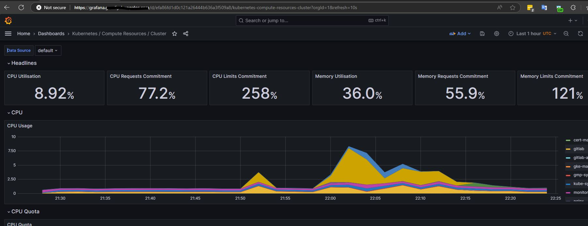
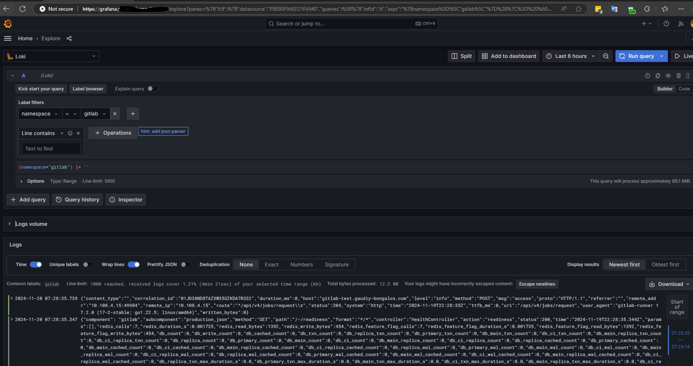
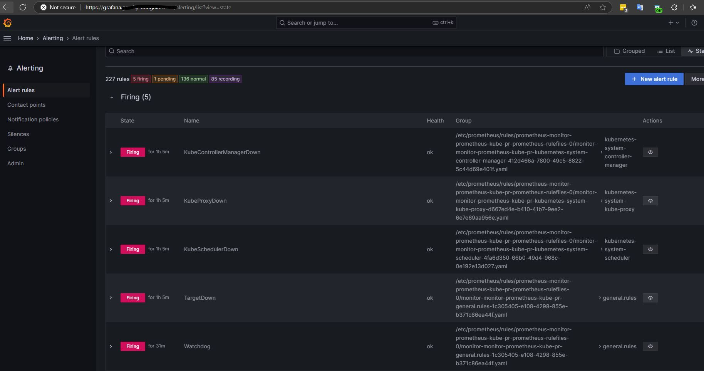

## DevOps Tools

this provisions infra and tools to GCP:
- GKE cluster (`platform/infra/k8s/cluster`)
- Certificate Manager (`platform/infra/k8s/cert-manager`)
- Nginx Ingress Controller (`platform/infra/k8s/ingress-controller`)
- Gitlab Community Edition (`platform/tools/gitlab`)
- SonarQube Community Edition (`platform/tools/sonarqube`)
- Observability Stack (`platform/tools/observability`)
  - Grafana
  - Prometheus
  - Loki/Promtail

### Steps

pending: `some steps below can be automated.`

1. login

```
gcloud auth application-default login --no-launch-browser
```

2. define Terraform variables file (terraform.tfvars)

- platform/infra/k8s/cluster/terraform.tfvars
- platform/infra/k8s/ingress-controller/terraform.tfvars
```
project  = <GCP Project>
```

- platform/infra/k8s/cert-manager/terraform.tfvars
```
project  = <GCP Project>
cert_issuer_email = <certificate issuance email contact>
ingress_classname = "nginx"
```

- platform/tools/gitlab/terraform.tfvars
```
project  = <GCP Project>
domain = <base domain>
host_suffix = "-test"
cert_issuer_email = <certificate issuance email contact>
cert_cluster_issuer = "clusterissuer-letsencrypt-dev"
```

- platform/tools/observability/terraform.tfvars
```
project  = <GCP Project>
domain = <base domain>
```

- platform/tools/sonarqube/terraform.tfvars
```
project  = <GCP Project>
domain = <base domain>
cert_cluster_issuer = "clusterissuer-letsencrypt-dev"
```

3. provision all
```
./common/scripts/up.bash -w dev -a
```

4. update local kube config
```
gcloud container clusters get-credentials gke-cluster1-dev --region asia-northeast1 --project <GCP Project>
```

5. retrieve Gitlab root user password.
- url: https://gitlab-test.`BASE_DOMAIN`
- user: root
- password:
```
kubectl get secret -n gitlab gitlab-gitlab-initial-root-password -ojsonpath='{.data.password}' | base64 --decode
```

6. create "demo" group in Gitlab

7. create user token in sonarqube. then define CI/CD variables.

- Sonarqube Instance
  - url: https://sonarqube.`BASE_DOMAIN`
  - user: admin
  - password: admin (please update)

- CI/CD variables

  - SONAR_URL
    - https://sonarqube.`BASE_DOMAIN`

  - SONAR_TOKEN
    - created user token

8. check Grafana

- Instance
  - url: https://grafana.`BASE_DOMAIN`
  - user: admin
  - password: prom-operator

- metrics



- logs



- alerts



### Steps for each project

1. connect Gitlab to deployment target Kubernetes cluster
- under Operate -> Kuberentes Clusters, click on "Connect a cluster"
- set name to "default" the register
- will be provided with commands below. please execute
```
helm repo add gitlab https://charts.gitlab.io
helm repo update
helm upgrade --install default gitlab/gitlab-agent \
    --namespace gitlab-agent-default \
    --create-namespace \
    --set image.tag=v17.2.1 \
    --set config.token=<token> \
    --set config.kasAddress=wss://kas-test.<base domain> \
    --set replicas=1
```
